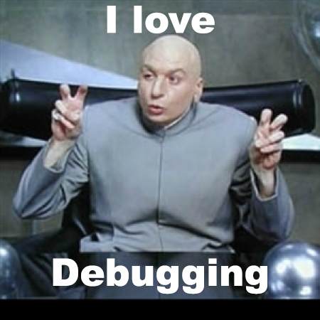

# 0x0D. Web stack debugging #0
Concepts
For this project, we expect you to look at these concepts:

- [Network basics](https://intranet.alxswe.com/concepts/33)
- [Docker](https://intranet.alxswe.com/concepts/65)
- [Web stack debugging](https://intranet.alxswe.com/concepts/68)

## Installing Docker
- For this project you will be given a container which you can use to solve the task. **If** you would like to have Docker so that you can experiment with it and/or solve this problem locally, you can install it on your machine, your Ubuntu 14.04 VM, or your Ubuntu 16.04 VM if you upgraded.

- [Mac OS](https://docs.docker.com/desktop/install/mac-install/)
- [Windows](https://docs.docker.com/desktop/install/windows-install/)
- [Ubuntu 14.04 (Note that Docker for Ubuntu 14 is deprecated and you will have to make some adjustments to the instructions when installing)](https://www.liquidweb.com/kb/how-to-install-docker-on-ubuntu-14-04-lts/)
- [Ubuntu 16.04](https://www.digitalocean.com/community/tutorials/how-to-install-and-use-docker-on-ubuntu-16-04)

## Resources
**man or help:**

- `curl`

## Task 
- [0. Give me a page!](https://intranet.alxswe.com/projects/265)
